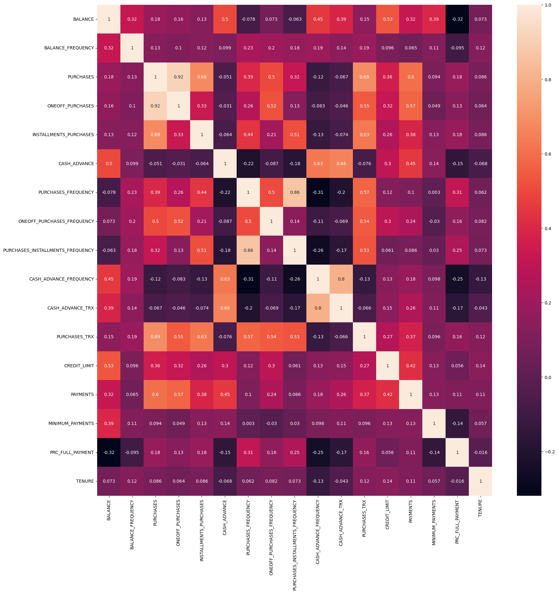

# Credit Card Customer Segmentation

Marketing is crucial for the growth and sustainability of any business.
Marketers can help build the company’s brand, engage customers, grow revenue, and increase sales.
One of the key pain points for marketers is to know their customers and identify their needs.
By understanding the customer, marketers can launch a targeted marketing campaign that is tailored for specific needs.
If data about the customers is available, data science can be applied to perform market segmentation. 

In this case study, I have been hired as a consultant to a bank in New York City. 
The bank has extensive data on their customers for the past 6 months. 
The marketing team at the bank wants to launch a targeted ad marketing campaign by dividing their customers into at least 3 distinctive groups.

[Go to Data Statistics](#general-statistics-of-data)

[Go to Visual Data Exploration](#visual-exploratory-data-analysis)

[Click here to go directly to the code in Python Notebook](https://github.com/data-z/PortfolioProjects/blob/212ec2b7c92ae05b8dc445b558f30b0cff671d79/Sales%20%26%20Marketing%20Analytics/Marketing%20Department/Marketing_Department.ipynb)

## The Data

The dataset consist of 18 columns and ~9,000 records. 
See Columns and definitions below:

- CUSTID: Identification of Credit Card holder
- BALANCE: Balance amount left in customer's account to make purchases
- BALANCE_FREQUENCY: How frequently the Balance is updated, score between 0 and 1 (1 = frequently updated, 0 = not frequently updated)
- PURCHASES: Amount of purchases made from account
- ONEOFFPURCHASES: Maximum purchase amount done in one-go
- INSTALLMENTS_PURCHASES: Amount of purchase done in installment
- CASH_ADVANCE: Cash in advance given by the user
- PURCHASES_FREQUENCY: How frequently the Purchases are being made, score between 0 and 1 (1 = frequently purchased, 0 = not frequently purchased)
- ONEOFF_PURCHASES_FREQUENCY: How frequently Purchases are happening in one-go (1 = frequently purchased, 0 = not frequently purchased)
- PURCHASES_INSTALLMENTS_FREQUENCY: How frequently purchases in installments are being done (1 = frequently done, 0 = not frequently done)
- CASH_ADVANCE_FREQUENCY: How frequently the cash in advance being paid
- CASH_ADVANCE_TRX: Number of Transactions made with "Cash in Advance"
- PURCHASES_TRX: Number of purchase transactions made
- CREDIT_LIMIT: Limit of Credit Card for user
- PAYMENTS: Amount of Payment done by user
- MINIMUM_PAYMENTS: Minimum amount of payments made by user
- PRC_FULL_PAYMENT: Percent of full payment paid by user
- TENURE: Tenure of credit card service for user

### General Statistics of Data

- Mean balance is $1564
- Balance frequency is frequently updated on average ~0.9
- Purchases average is $1000
- one off purchase average is ~$600
- Average purchases frequency is around 0.5
- average ONEOFF_PURCHASES_FREQUENCY, PURCHASES_INSTALLMENTS_FREQUENCY, and CASH_ADVANCE_FREQUENCY are generally low
- Average credit limit ~ 4500
- Percent of full payment is 15%
- Average tenure is 11 years

We looked at the customer with the highest One-Off Purchases and found:
- This customer has 101 purchase transactions 
- They have an $11,500 balance
- The customer does not use the cash advance alot but they make frequent purchases
- The customer only pays in full 25% of the time

We looked at the customer with the higest Cash Advances and found:
- This customer made 123 cash advance transactions!!
- They appear to use the cash advance more than purchases for some reason
- Never paid the credit card in full

After exploring the data for missing data we found **1 missing datapoint for Credit_Limit** and **313 missing data points for Minimum_Payment**.
We imputed the missing data points with the mean of each variable. We also drop any duplicate records and dropped the CUST_ID column since it has no meaning.

## Visual Exploratory Data Analysis
The first visual is a DistPlot that combines a Histogram with a Kernel Density Estimate Plot (KDE Plot). 
KDE demonstrates the probability density at different values in a continuous variable.
[You can view all DistPlot Images Here](https://github.com/data-z/PortfolioProjects/tree/4f86588dd9230fd3d9d2ff3680325801ab922737/Sales%20%26%20Marketing%20Analytics/Marketing%20Department/images) 

Upon analysis of the plots it was concluded that all the variables were non-normal distributions. 
We also observed some specific information in the data such as:
- Mean of balance is $1500
- 'Balance_Frequency' for most customers is updated frequently ~1
- For 'PURCHASES_FREQUENCY', there are two distinct group of customers
- For 'ONEOFF_PURCHASES_FREQUENCY' and 'PURCHASES_INSTALLMENT_FREQUENCY' most users don't do one off puchases or installment purchases frequently
- Very small number of customers pay their balance in full 'PRC_FULL_PAYMENT'~0
- Credit limit average is around $4500
- Most customers are ~11-12 years tenure

### Correlations
Most correlations are between related categories ie. Purchase Frequency and Purchase Transactions ect.

## Cluster Analysis

Before finding the optimal number of clusters, the data was scaled.knowing the distribution of the data is important when scaling, 
if most of the variables are normally distibuted we can get away with using the StandarScaler because it is not sensitive to outliers,
However, if most the variable have a non-normal distibution MinMaxScaler would be a better choice since in this data's case we do not want to mitigate outliers. 
[We'll write some code to pick the best scaler based on the distributions](Marketing_Department.ipynb#task--4--find-the-optimal-number-of-clusters-using-elbow-method-and-scaled-inertia).
MinMaxScaler was picked since there appears to be no normally distibuted variables.

### Finding the Optimal Number of Clusters
**In this next task we will be finding the optimal number of cluster in order to perform K-means analysis.**
We will be using 2 different techniques, the Elbow method and scaled Inertia. The Elbow Method is created by plotting the Within-Cluster Sum of Squares points and finding the point that forms the Elbow as the optimal number of clusters. The Scaled Inertia Method uses weighted inertial defined by an picked Alpha value and then automatically picks the number of clusters using the minimum adjusted inertia. **The Scaled Inertia Method was chosing for this project.**
[Please see the notebook for the code!](https://github.com/data-z/PortfolioProjects/blob/212ec2b7c92ae05b8dc445b558f30b0cff671d79/Sales%20%26%20Marketing%20Analytics/Marketing%20Department/Marketing_Department.ipynb)

Elbow Method: Based on the Elbow Method the optimal number of clusters is 7-8 that is aproxiatley when the values begin to reduce linearly.

---
Scaled Inertia Method: Based on the Scaled Inertia Method the optimal number of clusters is 10 that is the number of clusters that have the minimum adjusted inertia.

### Apply K-Means Method for Cluster Analysis

After fitting the data to the K-Means model, we created a cluster center dataframe, inversed the scaled values and did some further analsysis. 
[The dataframe can be found in the code here.](Marketing_Department.ipynb#task-5-apply-k-means-method)

***Below are the categories and descriptions concluded from the cluster centers:***

**Cluster 0 - Occasional Spender with Low Balance:**
*Category: "Occasional Spender"*
Description: Customers in this cluster have a relatively low balance, infrequently update it, and make moderate purchases, suggesting they use their credit cards for occasional spending.

**Cluster 1 - Responsible Moderate Spender:**
*Category: "Moderate Spender"*
Description: Customers in this cluster maintain a low balance but frequently update it, make moderate to high purchases (mainly installments), and exhibit responsible credit card usage.

**Cluster 2 - Balanced Moderate Spender:**
*Category: "Balanced Spender"*
Description: Customers in this cluster have a high balance, frequently update it, make moderate purchases (a mix of one-off and installments), and manage their credit card balance well.

**Cluster 3 - High-Volume One-Off Spender:**
*Category: "One-Off Spender"*
Description: Customers in this cluster maintain very high balances, frequently update them, and make high purchases, primarily through one-off transactions, indicating significant one-time expenses.

**Cluster 4 - Balanced Moderate Spender (Installment Focus):**
*Category: "Balanced Spender"*
Description: Customers in this cluster have a high balance, frequently update it, make moderate purchases (mainly through installment payments), and manage their credit card balance well.

**Cluster 5 - High-Balance Low Spender:**
*Category: "Low Spender"*
Description: Customers in this cluster maintain very high balances, frequently update them, but make low purchases and rarely engage in cash advances, suggesting they may use their credit cards as a financial tool rather than for spending.

**Cluster 6 - Extremely High-Balance Low Spender:**
*Category: "Low Spender (Extremely High Balance)"*
Description: Customers in this cluster have extremely high balances, frequently update them, but make very low purchases and rarely engage in cash advances, indicating an emphasis on credit card balance management.

**Cluster 7 - High-Volume Spender with High Balance:**
*Category: "High Spender"*
Description: Customers in this cluster have very high balances, frequently update them, make high purchases, and maintain a moderate cash advance frequency, indicating a substantial credit card usage pattern.

**Cluster 8 - Moderate Spender with Low Payments:**
*Category: "Moderate Spender (Low Payments)"*
Description: Customers in this cluster have moderate balances, make moderate purchases, but have lower payment amounts, possibly indicating a need for better payment management.

**Cluster 9 - High Spender with Full Payments:**
*Category: "High Spender (Full Payments)"*
Description: Customers in this cluster maintain a low balance, frequently update it, make high purchases, and exhibit a high percentage of full payments, suggesting responsible credit card usage with frequent full payments.

**Lets see what clusters our earlier observation of the Max One-Off and Max Cash Advance Customers fall in.**
The customer with the highest One-Off Purchases is in cluster 6 which is Extremely High-Balance Low Spender.
The customer with the highest Cash Advances is in cluster 3 whcih is High-Volume One-Off Spender.

### K-Means Cluster Visualization Using Principle Component Analysis (PCA)
Principal Component Analysis (PCA) is a dimensionality reduction method that transforms a dataset with multiple dimensions into a smaller set of linearly uncorrelated variables known as principal components, which retain most of the variability present in the data. When applied prior to K-means clustering, PCA facilitates visualization in two or three dimensions, enhances computational efficiency, reduces noise, and can improve cluster separation by mitigating the curse of dimensionality. This pre-processing step can lead to more insightful and meaningful clustering results, particularly when dealing with complex, high-dimensional datasets.

This is the K-Mean Clusters reduced to 2 dimensions for visualization.

## Dimensional Reduction Using Autoencoders
***In this section we will use Autoencoders to reduce the dimensions and then run the KMeans Clustering again on the reduced dimensions.***

Autoencoders, a type of neural network, serve as a powerful tool for dimensionality reduction, particularly effective in distilling complex, high-dimensional data into a more compact and meaningful representation. When applied before K-means clustering, autoencoders learn to encode the data into a lower-dimensional space (the bottleneck layer) and then decode it back to its original dimension, capturing the most salient features in this process. This compressed representation, often more informative than the raw high-dimensional data, can significantly enhance K-means clustering by focusing on the core characteristics of the data, thereby leading to more distinct and interpretable clusters. This approach is especially beneficial for datasets where linear methods like PCA fall short, such as those with non-linear relationships, enabling a more nuanced understanding of the data's underlying structure through clustering.

### Autoencoder Process
The process starts with the input data, which goes through several layers of processing, each reducing the data further. The first layer reduces the data from 17 features to 7, and subsequent layers increase the complexity temporarily to 500 and then to 2000. However, the crucial part is the 'encoded' layer, where the data is compressed down to just 10 key features. This is the heart of the autoencoder, capturing the essence of the data in a more manageable form.
[Please see the notebook for the actual code details](Marketing_department.ipynb)

### Finding the Optimal Number of Clusters

*In this section we used the same methods as above to find the optimal number of clusters*

Elbow Method: Based on the Elbow Method the optimal number of clusters is 5-6 that is approximately when the values begin to reduce linearly

Scaled Inertia Method: Based on the Scaled Inertia Method the optimal number of clusters is 8 that is the number of clusters that have the minimum adjusted inertia

